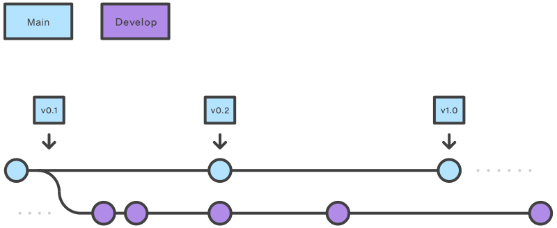

# GitFlow

É um fluxo de trabalho para o **Git** criado para facilitar o processo de desenvolvimento com uma série de comandos novos. O **Gitflow** é apenas uma ideia abstrata do fluxo de trabalho **Git**, ou seja, ele dita que tipos de ramificações configurar e como fazer o *merge*.

Essas ramificações são divididas como abaixo:


---

# 1. Funcionamento

É composta por duas *branch’s* principais e três *branch’s* de suporte. As duas *branch’s* principais são `main` e `develop`, já as *branch’s* de suporte são `feature`, `release` e `hotfix`. Vamos ver um pouco sobre cada uma delas.

Ao longo do texto, iremos abordar os comandos de duas formas: da forma convencional; usando *GitFlow Extensions*. Devido a isso temos alguns comandos:


> 💡 Podemos visualizar os comandos rapidamente através do ***cheatsheet*** encontrado em [https://danielkummer.github.io/git-flow-cheatsheet/index.pt_BR.html](https://danielkummer.github.io/git-flow-cheatsheet/index.pt_BR.html). Nesse link também contém um conteúdo riquíssimo: [https://www.atlassian.com/br/git/tutorials/comparing-workflows/gitflow-workflow](https://www.atlassian.com/br/git/tutorials/comparing-workflows/gitflow-workflow).


---

## 1.1. Branch’s Principais





A *branch* `main` armazena o histórico de lançamento oficial que normalmente está em produção, então tenha muito cuidado. É normal em que cada *commit* publicado a essa *branch* também acompanhe uma **tag** com o número da versão.

O primeiro passo seria criar um novo repositório no **Github** (ou outros provedores), logo após devemos criar uma *branch* `develop` a partir da `main` como mostra abaixo:

```json
git branch develop
git checkout develop
git push -u origin develop
```

Criamos então a *branch* e já acessamos com o comando `checkout`. Criando a *branch* `develop` é uma boa prática fazer o *push* logo após a criação dessa branch. 

> 💡 Podemos simplificar os comandos com a extensão do próprio *Git Flow*, usando o comando `git flow init`. Ela cria todas as possíveis ramificações e facilita bastante o trabalho.
>
> 
>
> Algumas configurações são feitas, basta dar enter. Automaticamente é criada e feita a transferência para a *branch* `develop`.
>
> 
>

Já a *branch* `develop` serve como uma ramificação de integração para recursos. Esta ramificação vai conter o histórico completo do projeto, enquanto a ramificação `main` vai conter uma versão abreviada. 

Algumas dicas: 

- Nada é realmente criado na *branch* `develop`, todas as novas funcionalidades são desenvolvidas da *branch* `feature`;

- Nunca é feita um *merge* da `develop` para a `main`. Os *merges* feito em `main` são originados das *branch’s* `release` quando se trata de uma nova versão ou `hotfix` quando ocorre um **bug** em produção.

  

---

## 1.2. Branch’s Suporte

Existem três *branch’s* de suporte, são elas:

### 1.2.1. Feature

A `feature` é uma *branch* temporária que contém uma funcionalidade sendo desenvolvida. Essa ramificação não puxa diretamente da `main`, mas sim da `develop`. Quando concluído é feito um merge em `develop` da `feature` desenvolvida, como mostra na imagem. 


**CRIANDO NOVA FEATURE**

Para criar uma nova `feature` devemos acessar a *branch* de `develop` e criamos uma nova *branch* a partir dela:

```json
git checkout develop
git checkout -b feature/addfunction
```


Por convenção, criamos uma `feature` com o nome no padrão `feature/feature-name`.

Ou se estivermos usando a extensão do **Git Flow**, podemos criar uma nova `feature` através do comando:

```json
git flow feature start addfunction
```


Com esse comando não precisamos inserir `feature/` no nome, basta indicar o nome da `feature`.


**FINALIZANDO UMA FEATURE**

Assumindo que a `feature` está pronta (feita os *add’s* e *commit’s*), devemos então mesclar a `feature` com o `develop`. Para isso, poremos ir na *branch* `develop` e fazer um *merge* da `feature`. Vejamos:

```json
git checkout develop
git merge feature/addfunction
```


Ou podemos utilizar o *GitFlow Extensions*: 

```json
git flow feature finish addfunction
```


> 💡 **IMPORTANTE!**
> Com o *GitFlow Extensions* automaticamente a *branch* de `feature` é excluída. É uma escolha da equipe de desenvolvimento se excluirá ou não as `feature`, porém, é um padrão do *GitFlow*. Caso queira excluir basta: `git branch -d feature/feature-name`, porém, para excluir remotamente é necessário o comando `git push origin :feature/feature-name`.


### 1.2.2. Release

Uma vez que a ramificação `develop` adquiriu recursos suficientes para um lançamento (ou uma data de lançamento predeterminada está se aproximando), você bifurca uma ramificação  `release` a partir da ramificação `develop`.

Criar esta ramificação dá início ao próximo ciclo de lançamento, portanto nenhum novo recurso pode ser adicionado depois deste ponto — **apenas atualizações de segurança, geração de documentação e outras tarefas relacionadas ao lançamento devem ir nesta ramificação**.

Quando estiver pronta para ser lançada, a ramificação `release` **passa por *merge* para a ramificação** `main` **e é marcada com o número da versão**. **Ela também deve passar por *merge* de volta para a ramificação** `develop`, que pode ter progredido desde que o lançamento foi iniciado.

A elaboração de ramificações de `release` é outra operação de ramificação simples. Assim como as ramificações de `feature`, as ramificações de `release` são baseadas na ramificação de `develop`.


**CRIANDO NOVA RELEASE**

Uma nova ramificação de `release` pode ser criada usando os seguintes métodos:

```json
git checkout develop
git checkout -b release/0.1.0
```


> 💡 Observe que agora o nome da `release` segue um outro padrão, constituido pelo `release` seguido do número de uma versão: `release/0.1.0`.

Ou podemos utilizar o *GitFlow Extensions*:

```json
git flow release start 0.1.0
```


**FINALIZANDO UMA RELEASE**

Depois que a versão estiver pronta para o lançamento, será feito o **merge dela na ramificação**  `main` **e na ramificação** `develop` e, então, a ramificação `release` será excluída. O processo de merge de volta para a ramificação `develop` é importante porque atualizações importantes podem ter sido adicionadas à ramificação `release` e elas devem ser acessíveis a novos recursos. Se sua organização enfatiza a revisão de códigos, este seria o local ideal para uma solicitação *pull request*.

Para finalizar a ramificação de `release`, use os seguintes métodos:

```json
git checkout main
git merge release/0.1.0
git checkout develop
git merge release/0.1.0
```


Ou podemos utilizar o *GitFlow Extensions*:

```json
git flow release finish 0.1.0
```


> 💡 **IMPORTANTE!**
> Com o *GitFlow Extensions* automaticamente a *branch* de `release` é excluído. Novamente,  é uma escolha da equipe de desenvolvimento se excluirá ou não as `release`, porém, é um padrão do *GitFlow*. Caso queira excluir basta: `git branch -d release/0.1.0`, porém, para excluir remotamente é necessário o comando `git push origin :release/0.1.0`.

> 💡 **IMPORTANTE!**
> É nesse momento que também é criada uma ***tag*** com a versão atual vinda da `feature`. Podemos fazer isso conforme abaixo:
>
>
> ```json
> git checkout main
> git tag -a v0.1.0 -m 'description version'
> git push -u origin v0.1.0
> ```
>
> E claro, não se esqueça de realizar o *push*.


### 1.2.3. Hotfix

As ramificações de manutenção ou de `hotfix` são usadas para **corrigir com rapidez lançamentos de produção**. As ramificações de `hotfix` se parecem muito com ramificações `release` e `feature`, com a diferença de serem baseadas na ramificação `main` ao invés da ramificação `develop`. Esta é a única ramificação que deve ser bifurcada direto da ramificação `main`.

Assim que a correção é concluída, **deve ser feito o *merge* dela tanto na ramificação** `main` **quanto na ramificação** `develop` (ou na ramificação `release` atual) **e a ramificação** `main` **deve ser marcada com um número de versão atualizado**.


**CRIANDO NOVA HOTFIX**

Uma ramificação de `hotfix` pode ser criada usando os seguintes métodos:

```json
git checkout main
git checkout -b hotfix/bug1
```


Ou podemos utilizar o *GitFlow Extensions*:


**FINALIZANDO UMA HOTFIX**

Assim como acontece na finalização da ramificação `release`, é feito o *merge* da ramificação de `hotfix` tanto na ramificação `main` quanto na ramificação `develop`:

```json
git checkout main
git merge hotfix/bug1
git checkout develop
git merge hotfix/bug1
```


Ou podemos utilizar o *GitFlow Extensions*:

```json
git flow hotfix finish bug1
```


> 💡 **IMPORTANTE!**
> Com o *GitFlow Extensions* automaticamente a *branch* de `hotfix` é excluída. Novamente, é uma escolha da equipe de desenvolvimento se excluirá ou não as `hotfix`, porém, é um padrão do *GitFlow*. Caso queira excluir basta: `git branch -d hotfix/name-hotfix`, porém, para excluir remotamente é necessário o comando `git push origin :hotfix/name-hotfix`.

> 💡 **IMPORTANTE!**
>
>
> Nesse momento TAMBÉM é criada uma ***tag*** com a versão atual vinda da `hotfix`. Podemos fazer isso conforme abaixo:
>
> ```json
> git checkout main
> git tag -a v0.1.1 -m 'correção error'
> git push -u origin v0.1.1
> ```
>
> E claro, não se esqueça de realizar o *push*.


---

# 2. *GitFlow Extensions*

O *GitFlow Extensions* contém os seguintes comandos:


O qual:

- `git flow init` inicia um novo projeto com o *GitFlow Extensions* e todos os métodos descritos na imagem e abaixo;
- `start` inicia uma nova `feature`, `release` ou `hotfix`;
- `finish` finaliza uma `feature`, `release` ou `hotfix`;
- `publish` publica uma `feature`, `release` ou `hotfix` ao servidor remoto;
- `pull` obtem as funcionalidades publicadas por outros usuários em uma `feature`, `release` ou `hotfix`.

> 💡 O *GitFlow Extensions* só vem por padrão na instalação feita no Windows.


---

# 3. Fluxo de Trabalho

